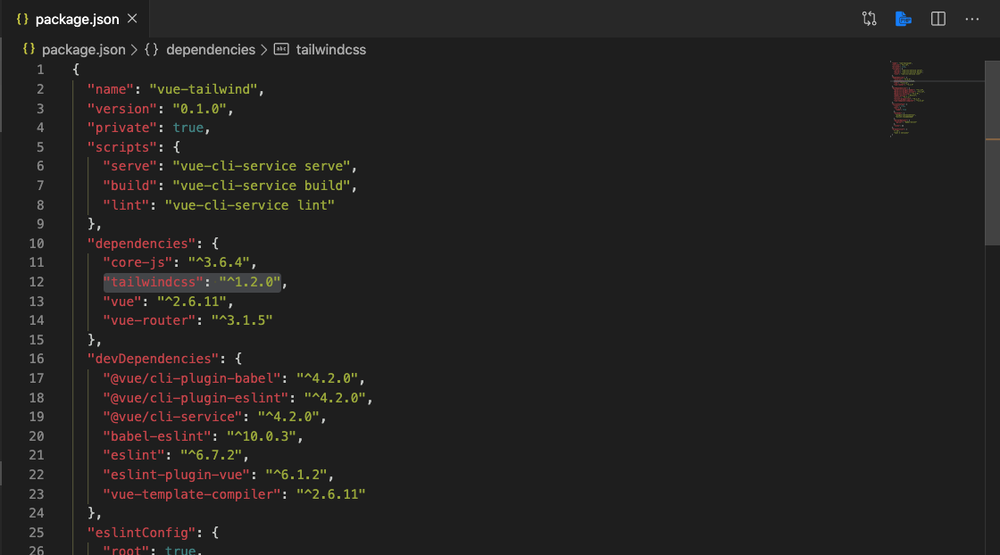
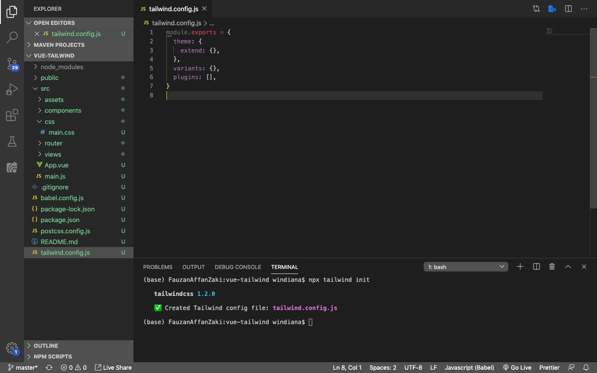

# Instalasi Tailwindcss

Pada Vue, kita bisa menggunakan command prompt atau terminal untuk menginstalasi project Vue yang sudah kita buat terlebih dahulu menggunakan Vue CLI. **Jangan lupa tambahkan Vue Router** di dalamnya untuk navigasi antar componentnya. Selanjutnya, project tersebut akan kita tambahkan Tailwindcss di dalamnya.

Ini adalah tampilan awal ketika menjalankan project Vue yang sudah saya buat dengan nama `vue-tailwind`:


> ***Tips & trick:*** Buat project Vue yang mau digunakan terlelbih dahulu, baru setelah itu tambahkan Tailwindcss ke dalamnya.

## Instal Tailwindcss

Buka project yang teman-teman gunakan di terminal. Pastikan folder project sudah benar. Pada demo kali ini, saya menggunakan project Vue dengan nama `vue-tailwind`.


Selanjutnya, buka website tutorial instalasi Tailwindcss [di sini](https://tailwindcss.com/docs/installation/). Disana ada beberapa bagian saja yang akan kita terapkan ke dalam project Vue kita, bagian-bagiannya dimulai dari:

1. *Install Tailwind via npm*

    Kita akan menginstal Tailwind via npm. Pastikan komputer teman-teman sudah terinstal dengan Node.js supaya bisa menggunakan npm.

    Jalankan sintaks berikut di dalam terminal:

    ```py
    # Using npm
    npm install tailwindcss
    ```

    

    Buka file `package.json`, dan pastikan sudah terdapat Tailwindcss:

    

2. *Add Tailwind to your CSS*

    Selanjutnya buka folder `src`, dan buat satu folder baru dengan nama `css`. Di dalam folder `css`, buat file dengan nama `main.css`, dan isikan sintak berikut, lalu save:

    ```js
    @tailwind base;

    @tailwind components;

    @tailwind utilities;
    ```

    

    Selanjutnya, jangan lupa kita import `main.css` yang tadi sudah kita buat ke dalam root component kita, yaitu `App.vue`. Hapus seluruh isi style dan buat element style menjadi seperti ini:

    ```html
    <style src="./css/main.css" />
    ```

    

3. *Process your CSS with Tailwind*

    Pada bagian ini kita akan menambahkan Tailwind di dalam [postcss](https://github.com/postcss/postcss#usage). Postcss berguna untuk menerjemahkan style yang dibuat menggunakan Javascript, menjadi CSS di website.

    Buat satu file baru di tempat yang sejajar dengan `package.json`, dengan nama `postcss.config.js`. Selanjutnya tambahkan sintak berikut, lalu save:

    ```js
    module.exports = {
        plugins: [
            // ...
            require('tailwindcss'),
            require('autoprefixer'),
            // ...
        ]
    }
    ```

4. *Generate Tailwind*

    Selanjutnya kita coba men-*generate* Tailwind configuration. Karena Tailwind memperbolehkan kita membuat custom CSS, maka ini akan berguna untuk menerjemahkan custom CSS yang sudah kita buat menjadi satu bundle Tailwindcss nanti, dengan menggunakan sintak:

    ```js
    npx tailwind init
    ```

    Jika berhasil tampilannya akan mirip seperti ini:

    

    Dan akan membuat satu file baru yang lokasinya sejajar dengan `package.json`, dengan nama `tailwind.config.js`. Isinya seperti berikut:

    

5. *Make Sure It Works!*

    Kita coba tambahkan class yang ada di Tailwindcss pada tag `<p>` di component `HelloWorld.vue`, lalu jalankan:

    

    * `bg-bluee-500` digunakan untuk membuat background menjadi warna biru, dengan tingkat transparansinya 500
    * `text-white` digunakan untuk merubah warna text menjadi putih

    Jika berhasil, hasilnya adalah sebagai berikut:

    
